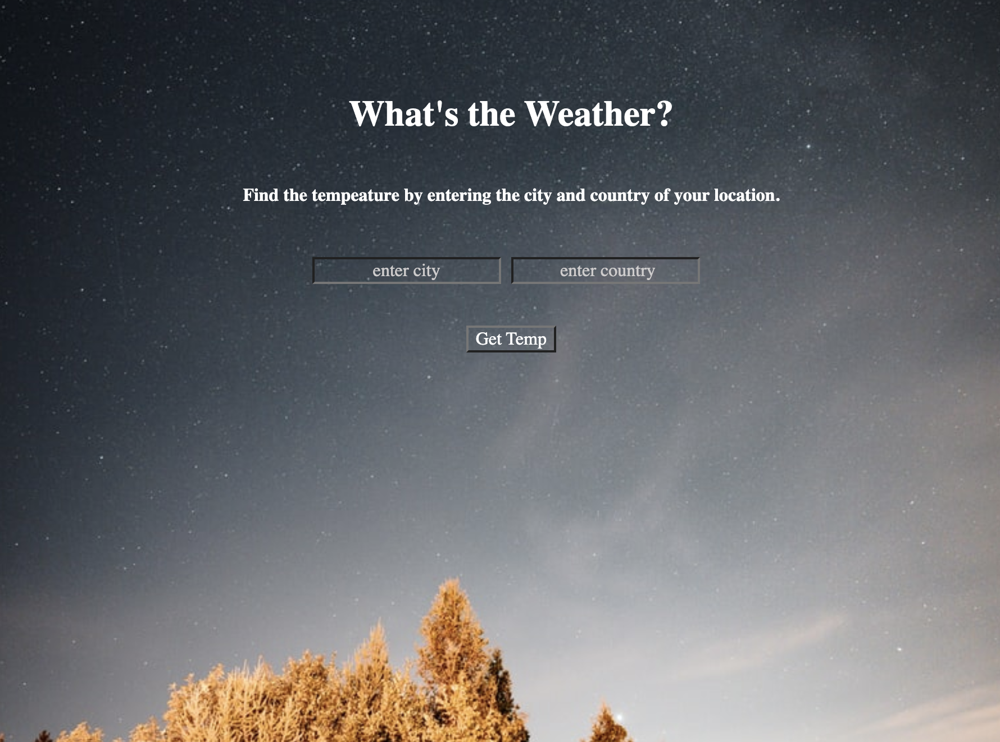

## 🚀 Project: Simple NASA API

### 🌞 Goal:
Enable leuser to enter a city + country and return the temperature in Fahrenheit. 

### 🌞 How it was made:
HTML5, CSS3, Javascript E6, API, JSON

### 🌞 Lesson Learned: 
 How to retrieve  data from an object in an API. 
